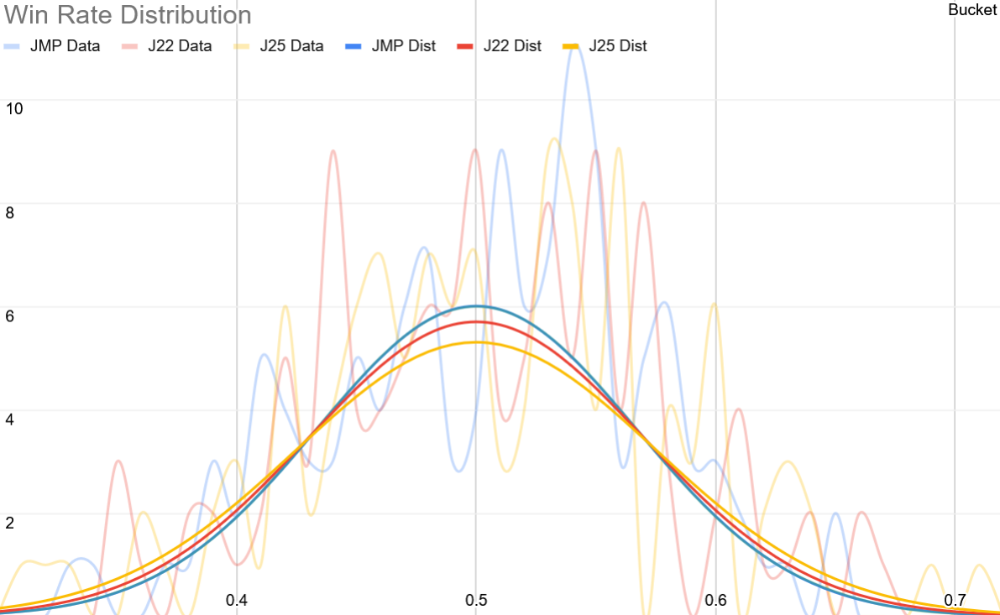
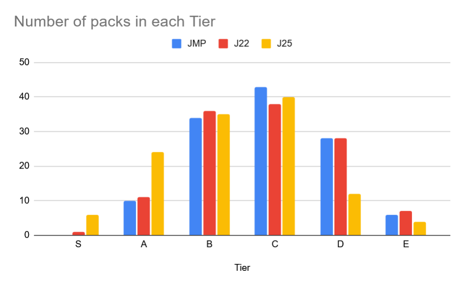

# Jumpstart (JMP) vs. Jumpstart 2022 (J22) vs. Foundations Jumpstart (J25)

## Balancing

We can estimate the balance of a jumpstart set by comparing statistics about win rates of the packs it contains. We 
expect the win rates to follow a distribution that can be approximated by a normal distribution.

Normal distributions have 2 parameters, mean and standard deviation.
- Win rates are always going to have a mean equal to 0.5. For each winner there is always a loser, so we always have the 
  same number of winners and losers, and therefore have a total average win rate of 50%
- Standard deviation indicates the "spread" of win rates. A higher standard deviation indicates that there are more 
  packs with higher win rates and more packs with lower win rates, which altogether means a less balanced format with 
  more dominating packs.

Using the game records for each set, we get the following standard deviation:

- JMP: 6.6%
- J22: 7.0%
- J25: 7.5%

This indicates that the best balanced Jumpstart set is actually the original Jumpstart (JMP), with Foundations Jumpstart
(J25) being the worst balanced.

This is interesting because it seems to be contrary to what I've observed being the most popular belief on this sub.

## Relative Power level

The data for this section comes from [a record of > 1 million games](../records/random/J22-J25-JMP.csv) played by making
decks using 2 random packs picked from all 3 jumpstart sets.

It is immediately obvious that J25 has a much higher power level that the other 2 sets, with many more packs in the best
tiers (S, A) and significantly less in the worst ones (D, E). J22 and JMP are almost equal, with maybe a very slight 
edge for J22. 

## Pack Tier List

Since there are way too many packs (363), I'm just going to list the best packs (tiers S and A) and the worst packs 
(tier E). The full data is available in CSV format in the [github repo](../ratings/random/J22-J25-JMP-boosters.csv).

**Tier S:** J25 Healers 1-4, J25 Enchanted 4, J25 Soaring 3, J22 Fangs 1

**Tier A:** J22 Constellation 1, J22 Fangs 2+3+4, J22 Holy 2+3+4, J22 Inventive 1+3, J22 Merfolk 2+4, J25 Angels 1+2, 
J25 Armed 2+3, J25 Clerics 1, J25 Dinosaurs 1, J25 Enchanted 3, J25 Explorers 4, J25 Ghastly 2+3, J25 Giddyap, 
J25 Grave Robbers 4, J25 Icky 2, J25 Landfall 3, J25 Legion 1+2, J25 Prideful, J25 Soaring 2, J25 Stalwart 1+2+4, 
J25 Vampires 2+3+4, JMP Dinosaurs 1, JMP Discarding 1+2, JMP Dragons 1+2, JMP Enchanted 1, JMP Goblins 3, 
JMP Tree Hugging 4, JMP Vampires 3+4 

**Tier E:** J22 Cruel 3, J22 Cycling 2, J22 Detective 2+4, J22 Faeries 1+2, J22 Law 3, J25 Bookworms 2+3, 
J25 Of the Coast 1+2, JMP Minions 3+4, JMP Spellcasting 4, JMP Under the Sea 2, JMP Walls, JMP Well-Read 4

## Best Decks per Color Combination

Deck-level data was obtained using the [same 1.06 million games dataset as above](../records/random/J22-J25-JMP.csv),
making decks using 2 random packs picked from all 3 jumpstart sets, without repeats. The caveat to those results is that
due to the large number of possible decks (65'703) each deck has played ~32 games on average. That isn't a very 
high number of games, but should be sufficient to be pretty representative anyway.

There are absolutely busted decks (>95% win rate) for each single color, except mono-green which is just busted 
(85% win rate).

Most 2-color combinations have an absolutely busted deck, but Gruul stands out by its best deck having the lowest 
win rate at 82%.

The full list of ratings is available in CSV format on the [github repo](../ratings/random/J22-J25-JMP-decks.csv).

**Mono White:** J22 Holy 4 & J25 Healers 2 (TrueSkill: 24.77, Win Rate: 95%)

**Mono Blue:** J22 Merfolk 2 & J22 Merfolk 3 (TrueSkill: 24.62, Win Rate: 96%)

**Mono Black:** J25 Vampires 3 & JMP Reanimated 2 (TrueSkill: 24.09, Win Rate: 96%)

**Mono Red:** J25 Goblins 2 & JMP Goblins 3 (TrueSkill: 24.10, Win Rate: 97%)

**Mono Green:** J25 Landfall 4 & JMP Elves 2 (TrueSkill: 21.00, Win Rate: 85%)

**Azorius (WU):** J25 Healers 2 & J25 Wizards 2 (TrueSkill: 24.31, Win Rate: 96%)

**Orzhov (WB):** J22 Fangs 1 & J25 Healers 2 (TrueSkill: 23.83, Win Rate: 96%)

**Boros (RW):** J25 Healers 3 & JMP Dragons 1 (TrueSkill: 20.68, Win Rate: 89%)

**Selesnya (GW):** J25 Healers 3 & JMP Elves 2 (TrueSkill: 23.24, Win Rate: 95%)

**Dimir (UB):** 25 Nefarious & JMP Discarding 2 (TrueSkill: 21.64, Win Rate: 91%)

**Izzet (UR):** J25 Burning & J25 Soaring 3 (TrueSkill: 20.60, Win Rate: 86%)

**Simic (GU):** J22 Inventive 1 & J25 Landfall 3 (TrueSkill: 20.76, Win Rate: 86%)

**Rakdos (BR):** 22 Fangs 1 & J22 Goblins 1 (TrueSkill: 20.57, Win Rate: 89%)

**Golgari (BG):** J25 Vampires 3 & JMP Tree Hugging 4 (TrueSkill: 24.50, Win Rate: 96%)

**Gruul (RG):** JMP Dinosaurs 1 & JMP Smashing 1 (TrueSkill: 19.85, Win Rate: 82%)

## Resources and raw data
- Game records (CSV)
  - [Jumpstart (JMP) alone](../records/random/JMP.csv) (~118k games)
  - [Jumpstart 2022 (J22) alone](../records/random/J22.csv) (~117k games)
  - [Foundations Jumpstart (J25) alone](../records/random/J25.csv) (~117k games) 
  - [All 3 sets combined](../records/random/J22-J25-JMP.csv) (~1.06M games)
- Raw booster ratings
  - [Jumpstart (JMP) alone](../ratings/random/JMP-boosters.csv) (121 boosters)
  - [Jumpstart 2022 (J22) alone](../ratings/random/J22-boosters.csv) (121 boosters)
  - [Foundations Jumpstart (J25) alone](../ratings/random/J25-boosters.csv) (121 boosters)
  - [All 3 sets combined](../ratings/random/J22-J25-JMP-boosters.csv) (363 boosters)
- Raw deck ratings (CSV)
  - [Jumpstart (JMP) alone](../ratings/random/JMP-decks.csv) (7'260 decks)
  - [Jumpstart 2022 (J22) alone](../ratings/random/J22-decks.csv) (7'260 decks)
  - [Foundations Jumpstart (J25) alone](../ratings/random/J25-decks.csv) (7'260 decks)
  - [All 3 sets combined](../ratings/random/J22-J25-JMP-decks.csv) (65'703 decks)